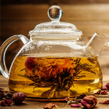
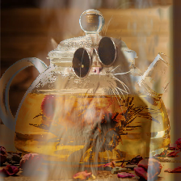

On fait une image en full gray avec v1-v2.full_gray.py

Image originale de internet: `theiere.webp`

On trouve une image qui resemble au chat, avec les mêmes teinte de couleur pour être le plus proche possible. On la crop et on la downscale a 224,224


C'est la V1:


On lui apllique la plus proche distance possible du chat avec l'algo: `vv1-vv2.teapot.py` en changant le nom des images theiere.png -> theiere.v2.png

On obtient V2:
 

On la modifie avec gimp pour être le que ça resbemble a une thiere

On obtient V2:
 


On lui apllique la plus proche distance possible du chat avec l'algo: `vv1-vv2.teapot.py` en changant le nom des images theiere.v3.png -> theiere.v4.png


On verifie avec notre `verificateur.py` et tout ses logs.
On a le bon resultat

On le met dans un truc d'image: https://imgtr.ee/images/2023/05/17/v4GHn.png, 

On l'envoie sur le netcat:


```
arkanyota@Arkans-MacBook-Air LePetitChat % nc challenges.404ctf.fr 32525
URL du chat > https://imgtr.ee/images/2023/05/17/v4GHn.png
1/1 [==============================] - 1s 1s/step
Je mérite le drapeau. Le voici : 404CTF{qU3l_M4n1f1qu3_the13R3_0r4ng3}
```
