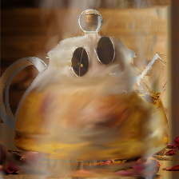

# Le Petit Chat

## Description
```
Ebloui par les reflets du soleil sur l'imposante vitrine du café littéraire lors d'une éclaircie, vous plissez les yeux et marquez un temps d'arrêt. Une boule dorée attire votre attention. Tiens, ce n'est pas une boule, mais un petit chat orange, le regard absorbé par la vitrine luisante. Vous vous étonnez de remarquer des lunettes de soleil surplombant ses magnifiques moustaches blanches, il semble étrangement équipé en cette pluvieuse journée. Par curisosité, vous sortez du café et vous vous approchez discrètement, ayant senti votre mouvement, le chat se retourna.
 
« Vous ne seriez pas Hackademicien par hasard, dit-il, d'un air effrayé.
— Non pourquoi ?
Soulagé, le petit chat se retourna complètement, se leva de tout son long sur ses deux pattes arrières, frotta ses griffes sur son pelage et vous tendit la patte.
— Je suis le Chat botté ! Ravi de faire votre connaissance !
 
N'étant pas plus surpris de voir un chat qui parle qu'un chat avec des lunettes languissant devant un café littéraire, vous décidez de tendre votre main à votre tour.
— Mon maître, Monsieur le Marquis de Carabas m'attend dans ce café, malheureusement, je ne peux pas le rejoindre, les chiens sont interdits.
— Et alors ? Vous êtes un chat, vous devriez pouvoir entrer.
— Justement, je suis censé pouvoir rentrer, mais l'intelligence artificielle qui garde l'entrée se mélange les neurones ! Voilà qu'elle confond les chiens et les chats.
— C'est très dérangeant.
— À cause de ce dysfonctionnement, je me retrouve dehors, dit-il, en levant ses lunettes et en vous regardant intensément avec ses gros yeux noirs et son aura envoûtante.
— Vous allez m'aider, n'est-ce pas ?
 
Ne sachant que répondre face à cette claire injustice, vous décidez seulement d'acquiescer de la tête. Satisfait, le chat s'approcha et vous proposa à voix basse :
— Vous vous y connaissez dans l'art du camouflage ? Oui ? Excellent, c'est exactement ce qu'il me faut. J'ai entendu dire que le thé était très apprécié dans cet endroit, pouvez-vous m'aider à me faire passer pour une théière ? Cela me permettrait de rejoindre mon maître ! »
 
Ne pouvant plus faire demi-tour, vous prenez une profonde respiration pour vous concentrer sur votre objectif : transformer ce petit chat roux en théière !
 
 
Pour valider le challenge, il faudra upload votre image de chat modifié sur internet et récupérer son URL. Enfin, il vous suffira de vous connecter via netcat et d'entrer l'URL du chat modifié. Voici un site possible : https://imgtr.ee/. L'image originale est téléchargeable ci-dessous : chat.jpg.
 
Vous pouvez vous aider du script verificateur.py afin d'avoir le modèle utilisé et de pouvoir essayer en local. Attention ! Ne ~modifiez~~ pas trop le petit chat, il faut que son maître puisse le reconnaître.
 
Un peu de lecture pour trouver l'inspiration : http://clpav.fr/lecture-chat-botte.htm. (Ne sert à rien pour résoudre le challenge)
Sckathach#9336
nc challenges.404ctf.fr 32525
```


On fait une image en full gray avec v1-v2.full_gray.py

Image originale de internet: `theiere.webp`

On trouve une image qui resemble au chat, avec les mêmes teinte de couleur pour être le plus proche possible. On la crop et on la downscale a 224,224


C'est la V1:


On lui apllique la plus proche distance possible du chat avec l'algo: `vv1-vv2.teapot.py` en changant le nom des images theiere.png -> theiere.v2.png

On obtient V2:
 

On la modifie avec gimp pour être le que ça resbemble a une thiere

On obtient V2:
 


On lui apllique la plus proche distance possible du chat avec l'algo: `vv1-vv2.teapot.py` en changant le nom des images theiere.v3.png -> theiere.v4.png


On verifie avec notre `verificateur.py` et tout ses logs.
On a le bon resultat

On le met dans un truc d'image: https://imgtr.ee/images/2023/05/17/v4GHn.png, 

On l'envoie sur le netcat:


```
arkanyota@Arkans-MacBook-Air LePetitChat % nc challenges.404ctf.fr 32525
URL du chat > https://imgtr.ee/images/2023/05/17/v4GHn.png
1/1 [==============================] - 1s 1s/step
Je mérite le drapeau. Le voici : 404CTF{qU3l_M4n1f1qu3_the13R3_0r4ng3}
```
