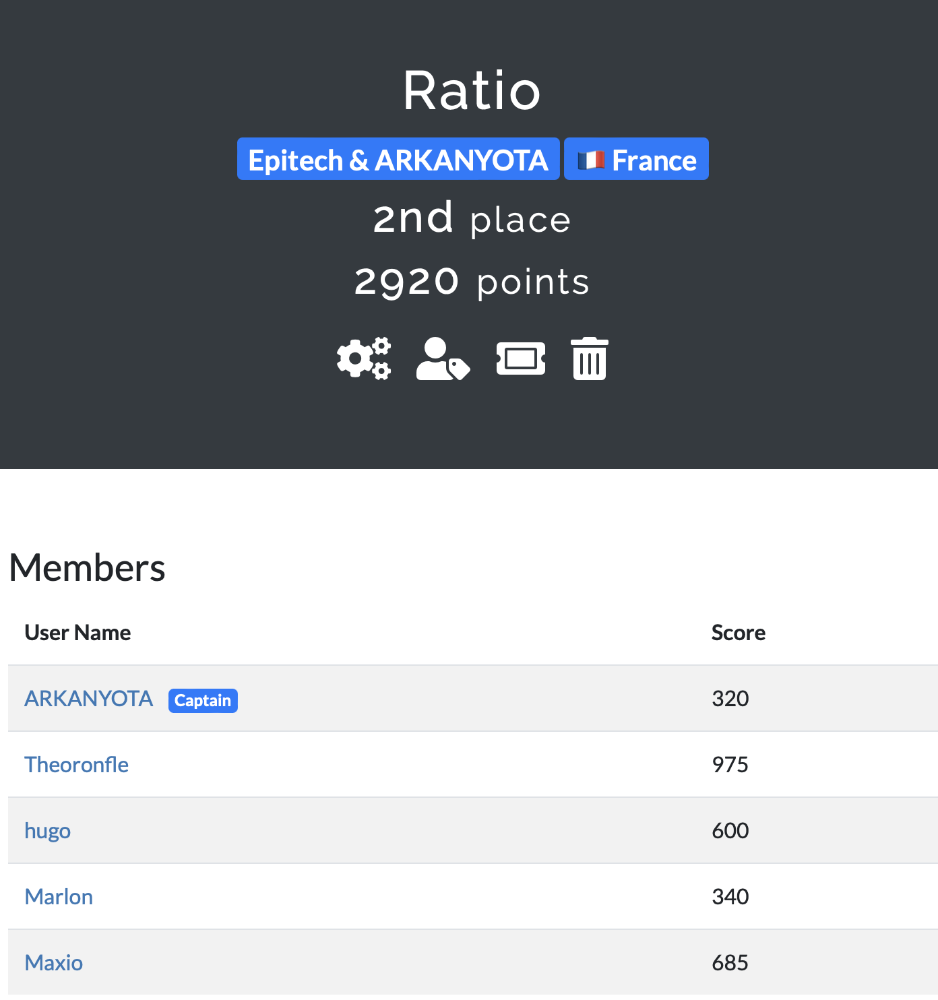

# OpenCycom2023

## Solutions

### Minuit
>> 300, April 29th, 12:19:13 AM
Chaque touche du piano = une lettre

### Usurpception
>> 500, April 28th, 11:53:34 PM

### Big blue whale
>> 100, April 28th, 11:17:34 PM
J'ai pas capté, mais full utilisation de docker

### Le Secret de la Tielle
>> 200, April 28th, 11:06:07 PM
unzip disk.zip
utilisation de e2fsck
puis mount disk.img	

### Troubadour - Part5
>> 30, April 28th, 10:31:33 PM
dans google: le café social Vincent lagaffe
==> https://www.facebook.com/225817917437188/photos/pb.225817917437188.-2207520000../3312156235469992/?type=3&eid=ARClNwLpmDIVKs8kEm1K4HaU5FWj8fCt1PQFzcCx2EzyVQufcnIieGusJwIRH3uZkIMDAx-19McA59rv

### XtraSuperSecure
>> 200, April 28th, 10:01:48 PM

### Troubadour - Part4
>> 30, April 28th, 10:00:11 PM
Google: ..., 
==> https://www.midilibre.fr/2020/03/25/sete-la-madone-de-richard-di-rosa-a-le-masque,8818528.php
on obtient place de l'hospiltalet sète

Apple map:
==> Le cafe social	

### Industrial Secrets - Partie 2
>> 200, April 28th, 9:56:28 PM
dans le terminal:
ftp <url>
<name part1>
<pass part1>	

download file
./gocrackzip dictattack ~/Downloads/Last_clients.zip rockyou.txt
ouvrir le fichier généerer avec libre office

### Troubadour - Part3
>> 30, April 28th, 9:52:23 PM
meme lien que la part1	

### SECURE KEY CHECK3R (Medium)
>> 400, April 28th, 9:48:35 PM
utilisation ghidra
comprendre comment le fichier est compresser.	

### Ca C Cool
>> 400, April 28th, 9:04:37 PM
utilisation ghidra
little endian -> big endian, et xor les 13 premier avec les 13 dernier	

### Industrial Secrets - Partie 1
>> 200, April 28th, 8:32:24 PM
tapper les commandes:     
username admin
password <celui qui est donne dans lenoncé>
setValvle <un nombre tres grand>
set<jsp>Text <une string tres grande>
get<jsp>FTP	

### SECURE KEY CHECK3R (Easy)
>> 300, April 28th, 8:26:10 PM
utilisation ghidra
avoir 1337 avec une somme des assci du message, en gardant les 3 char qui sont donnée

### Troubadour - Part2
>> 30, April 28th, 7:49:39 PM
meme lien que la part1

### Troubadour - Part1
>> 30, April 28th, 7:48:49 PM
Utilisation de google image
==> https://www.alamyimages.fr/photo-image-sculpture-la-madone-du-quartier-haut-ou-la-mamma-de-richard-di-rosa-a-sete-languedoc-roussillon-france-86379457.html

### Welcome
>> 10, April 28th, 7:44:19 P

## Mes resultats

### Classement: Top 2

